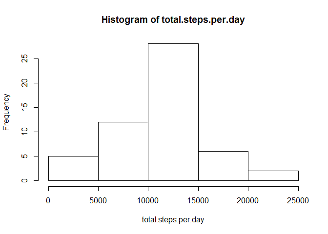
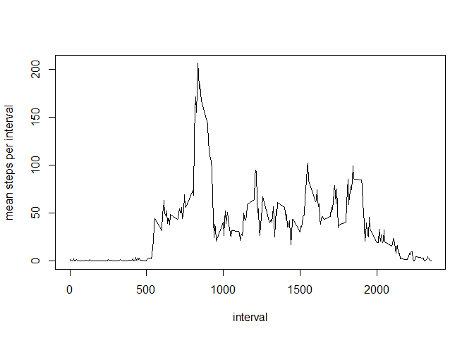
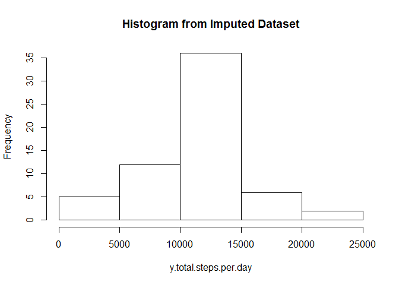
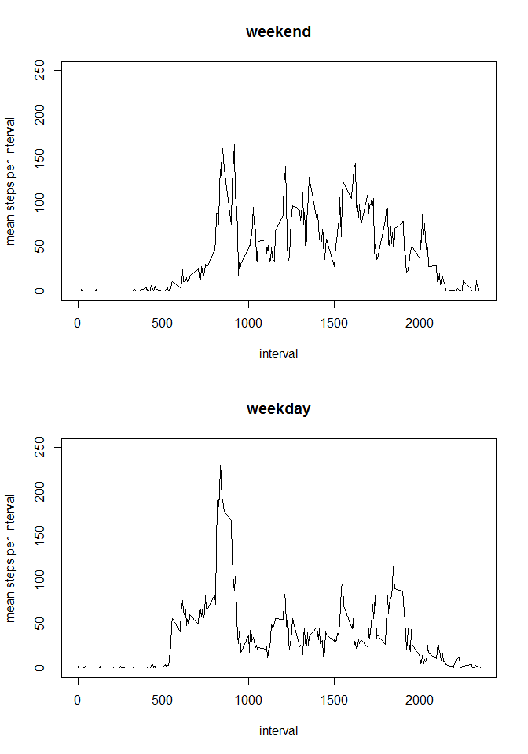

# Reproducible Research: Peer Assessment 1


## Loading and preprocessing the data
Begin by reading in the __activity.csv__ from the __activity.zip__ archive and storing in the dataframe $x$

```r
library(utils)
print(unzip(zipfile="activity.zip", list = FALSE))
```

```
## [1] "./activity.csv"
```

```r
xfil <- "activity.csv"
if( file.exists( xfil ) ){
  x <- read.csv(xfil,header=T)
}
```
Inspect the dataframe $x$:

```r
head(x)
```

```
##   steps       date interval
## 1    NA 2012-10-01        0
## 2    NA 2012-10-01        5
## 3    NA 2012-10-01       10
## 4    NA 2012-10-01       15
## 5    NA 2012-10-01       20
## 6    NA 2012-10-01       25
```

```r
summary(x)
```

```
##      steps                date          interval     
##  Min.   :  0.00   2012-10-01:  288   Min.   :   0.0  
##  1st Qu.:  0.00   2012-10-02:  288   1st Qu.: 588.8  
##  Median :  0.00   2012-10-03:  288   Median :1177.5  
##  Mean   : 37.38   2012-10-04:  288   Mean   :1177.5  
##  3rd Qu.: 12.00   2012-10-05:  288   3rd Qu.:1766.2  
##  Max.   :806.00   2012-10-06:  288   Max.   :2355.0  
##  NA's   :2304     (Other)   :15840
```

```r
c(class(x$steps),class(x$date),class(x$interval) )
```

```
## [1] "integer" "factor"  "integer"
```
Cast date to Date class.

```r
x$date     <- as.Date(x$date,"%Y-%m-%d")
```
And re-check classes:

```r
head(x)
```

```
##   steps       date interval
## 1    NA 2012-10-01        0
## 2    NA 2012-10-01        5
## 3    NA 2012-10-01       10
## 4    NA 2012-10-01       15
## 5    NA 2012-10-01       20
## 6    NA 2012-10-01       25
```

```r
summary(x)
```

```
##      steps             date               interval     
##  Min.   :  0.00   Min.   :2012-10-01   Min.   :   0.0  
##  1st Qu.:  0.00   1st Qu.:2012-10-16   1st Qu.: 588.8  
##  Median :  0.00   Median :2012-10-31   Median :1177.5  
##  Mean   : 37.38   Mean   :2012-10-31   Mean   :1177.5  
##  3rd Qu.: 12.00   3rd Qu.:2012-11-15   3rd Qu.:1766.2  
##  Max.   :806.00   Max.   :2012-11-30   Max.   :2355.0  
##  NA's   :2304
```

```r
c(class(x$steps),class(x$date),class(x$interval) )
```

```
## [1] "integer" "Date"    "integer"
```


## What is mean total number of steps taken per day?
Use the __tapply__ function to apply the __mean__ function across a ragged array. Here the application is over the date column (coerced back into being a factor for this part!). Remove the NA's as instructed

```r
logic <- !is.na(x$steps) #logical indicating NOT NAs
total.steps.per.day <- tapply(x$steps[logic],x$date[logic],sum)
```
Now plot a histogram of the results. Note: I decided to accept the default axes labels and bin-size.

```r
hist(total.steps.per.day)
```

 

The mean of the total number of steps taken per day is 

```r
mean.total.steps.per.day <- mean(total.steps.per.day)
mean.total.steps.per.day
```

```
## [1] 10766.19
```
and the median is 

```r
median.total.steps.per.day <- median(total.steps.per.day)
median.total.steps.per.day
```

```
## [1] 10765
```

## What is the average daily activity pattern?
I'll use __tapply__ again but average over the __interval__ variable this time. Plot the result in a line-graph.

```r
mean.steps.per.interval <- tapply(x$steps,x$interval,mean,na.rm=T)
xlab.steps.per.interval <- as.numeric( names(mean.steps.per.interval) )
plot(xlab.steps.per.interval,mean.steps.per.interval
     ,type="l",xlab="interval",ylab="mean steps per interval")
```

 

The interval with the maximum number of steps can be found as:

```r
(max.interval <- xlab.steps.per.interval[which.max(mean.steps.per.interval)])
```

```
## [1] 835
```
with an average of 206.17 steps.


## Imputing missing values

The total number of missing values reported as NA's in the dataset are as follows:

```r
(sum(is.na(x$steps)))
```

```
## [1] 2304
```
Let's derive a new dataset from the first $x$, call it $y$, and __impute__ the missing values by their average __interval__ value (averaged over all days):

```r
# 1. Get data frame of averages of intervals
m <- data.frame(interval=xlab.steps.per.interval,
                mean.steps.per.interval=mean.steps.per.interval)
# 2. Create y
y <- x
y$n <- 1:nrow(y)
# 3. Merge the average of intervals data into y
y <- merge(y,m,all.x=TRUE,by="interval")
# 4. Retrieve original order of y
y <- y[order(y$n),]
# 5. Impute missing data
y$steps[is.na(y$steps)] <- y$mean.steps.per.interval[is.na(y$steps)]
# 6. Drop temporary columns "n" and "mean.steps.per.interval"
y <- y[,-c(4,5)]
# 7. Retrieve original ordering of columns
y <- y[,c(2,3,1)]
```
Compute the results for the total steps per day using ($y$ with) __imputed step data__ in order to effect a comparison with the initial analysis where NA data was simply removed.  

```r
y.total.steps.per.day <- tapply(y$steps,y$date,sum)
```
A histogram of the results for the __imputed set__ is

```r
hist(y.total.steps.per.day,main="Histogram from Imputed Dataset")
```

 

The mean of the total number of steps taken per day for the __imputed set__ is 

```r
y.mean.total.steps.per.day <- mean(y.total.steps.per.day)
y.mean.total.steps.per.day
```

```
## [1] 10766.19
```
and the median is for the __imputed set__ 

```r
y.median.total.steps.per.day <- median(y.total.steps.per.day)
y.median.total.steps.per.day
```

```
## [1] 10766.19
```
The change in means is

```r
(y.mean.total.steps.per.day-mean.total.steps.per.day)
```

```
## [1] 0
```
which is zero! whilst the change in medians is

```r
(y.median.total.steps.per.day-median.total.steps.per.day)
```

```
## [1] 1.188679
```
which is very small: around 1 step. I conclude that imputing the missing data hasn't substantially changed the result from when the missing data was simply ignored. This may be a satisfactory approach if we can assume that the data which is missing is simply __missing at random__, which would tend to justify imputing some averaged value, and is not missing for some other reason. For example, if it could not be measured because it was too large and had saturated the mobile device.


## Are there differences in activity patterns between weekdays and weekends?

Make a factor variable corresponding to weekends and weekdays.

```r
y$day <- weekdays(y$date)
y$fac <- ifelse( y$day=="Saturday" | y$day=="Sunday", "weekend", "weekday" )
y$fac <- factor(y$fac)
```
And aggregate the data

```r
fac.mean.steps.per.interval <- tapply(y$steps,INDEX=list(y$interval,y$fac),mean)
fac.mean.steps.per.interval <- data.frame(interval=as.numeric(rownames(fac.mean.steps.per.interval)),
                                          fac.mean.steps.per.interval)
```
Now make the panel plot

```r
par(mfrow=c(2,1))
with( fac.mean.steps.per.interval,
     plot(interval,weekend,type="l",
          xlab="interval",ylab="mean steps per interval",main="weekend", ylim=c(0,250)) )
with( fac.mean.steps.per.interval,
     plot(interval,weekday,type="l",
          xlab="interval",ylab="mean steps per interval",main="weekday", ylim=c(0,250)) )
```

 

The plots suggest more activity earlier, periods 500-1000, during the week whilst at weekends, periods 1000-2000, there seems to be more activity than during weekdays.


